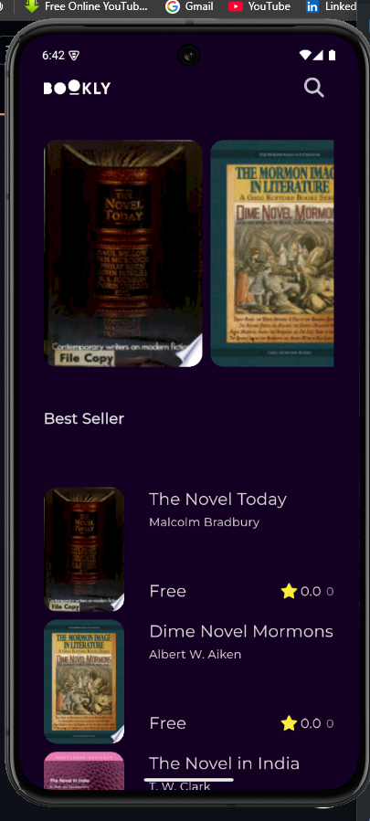

# 📚 Bookly App  
A clean and modern Flutter application for browsing, previewing, and managing books — built using **Clean Architecture**, **Cubit**, **Dio**, and **Hive** for offline caching.

---

## 📸 Screenshots
### Main Screens
| Home | Books List | Book Details |
|------|------------|--------------|
|  |  |  |

### Additional Screen
| Project Structure |
|--------------|
|  |


---

## 🚀 Overview  
**Bookly App** is a Flutter-based books application that fetches and displays book data from an API.  
It supports fast performance with offline caching using Hive, a clean and scalable architecture, and state management using Cubit.

---

## ✨ Features
- 🔍 Display featured books  
- 📖 Show Best Sellers  
- 📚 Detailed book view with rating and author  
- ⭐ “You may also like” book recommendations  
- ⚡ Offline caching using **Hive**  
- 🧱 Structured using **Clean Architecture**  
- 🛰️ API integration using **Dio**  
- 💙 State management using **Cubit**  
- 🎨 Smooth UI with animations

---

## 🛠 Tech Stack
- **Flutter**
- **Cubit (Bloc)** — State management  
- **Dio** — REST API client  
- **Hive** — Local storage and caching  
- **Clean Architecture** (Data — Domain — Presentation)

---

## 📁 Project Structure
```text
lib/
 ├── core/
 │    ├── baseUseCase/
 │    ├── errors/
 │    └── utils/
 ├── features/
 │    ├── home/
 │    │    ├── data/
 │    │    │    ├── data_source/
 │    │    │    └── models/
 │    │    ├── domain/
 │    │    │    ├── entities/
 │    │    │    ├── repos/
 │    │    │    └── usecases/
 │    │    └── presentation/
 │    │         ├── manager/
 │    │         │    ├── best_seller_cubit/
 │    │         │    ├── featured_cubit/
 │    │         │    └── also_like_cubit/
 │    │         └── views/
 ├── splash/
 ├── bookly_app.dart
 ├── constants.dart
 └── main.dart
